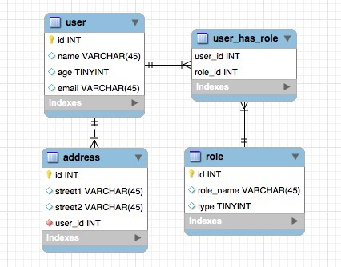

# Zeko Data Mapper


<p align="left">
    <a href="https://search.maven.org/search?q=g:%22io.zeko%22">
        
    </a>
    <a href="LICENSE">
        
    </a>
    <a href="https://github.com/KotlinBy/awesome-kotlin">
        
    </a>
</p>

A lightweight, fast and simple data mapper library in Kotlin that helps to map the result of queries from your normalized dataset(from RDBMS, SQLite, CSV or any source) back into relational mapped Hash maps

ps: Zeko turns out to be rabbit in Croatian, thus the logo :D

[Show your ❤ with a ★](https://github.com/darkredz/Zeko-Data-Mapper/stargazers)

### To use, add these to your maven pom.xml

    <dependency>
      <groupId>io.zeko</groupId>
      <artifactId>zeko-data-mapper</artifactId>
      <version>1.6.3</version>
    </dependency>
    
    
## Features
- No configuration files, no XML, no YAML, no annotations, lightweight, easy to use
- Fast startup & performance
- No Reflections. Great for [GraalVM](https://www.graalvm.org/) and [Quarkus](https://quarkus.io/)
    
## Basic usage
Use this library to denormalized your data from a plaintext CSV, in-memory data, RDBMS tables, etc.
Instead of using an ORM, do whatever you need to query & retrieve your normalized data, and mapped the data back 
into a relational nested object which make sense to your system.

### Configuring relationship of the normalized data
Given a MySQL database with tables of user, role and address, where each user should have one or more address and can have multiple roles. Every roles can be assigned to more than one users. So user-role is a many to many (M:M) relationship, user-address is 1:M relationship


 

```kotlin
val table = linkedMapOf<String, TableInfo>()
table["user"] = TableInfo(key = "id")
table["role"] = TableInfo(key = "id", move_under = "user", foreign_key = "user_id", many_to_many = true)
table["address"] = TableInfo(key = "id", move_under = "user", foreign_key = "user_id", many_to_one = true) 
```

### Using DataMapper class
DataMapper::map accepts the mapper config of your tables which it uses to understand the relationship of the flatten data structure.
Pass in the results of your sql query with the field names (with table name as prefix) to mapped the result.
More example can be found in [DataMapperSpec](https://github.com/darkredz/Zeko-Data-Mapper/blob/master/src/test/kotlin/com.zeko.model/DataMapperSpec.kt)

Example:
```kotlin
val rawResults = ArrayList<LinkedHashMap<String, Any>>()
rawResults.add(linkedMapOf(
    "user-id" to 1,
    "user-name" to "Leng",
    "role-id" to 2,
    "role-role_name" to "Super Admin",
    "role-user_id" to 1,   //this is selected as alias, not actual field in table. To be used with the mapper
    "address-id" to 128,
    "address-user_id" to 1,
    "address-street1" to "Some block",
    "address-street2" to "in the street"
))
```
Map the raw results into a denormalized structure
```kotlin
val mapper = DataMapper()
val result = mapper.map(tables, rawResults)
val json = Json.encodePrettily(result)
println(json)
```

map() method accepts a third argument which is to specify the delimiter of the column name, eg. user-id
By default it uses "-" but you can always change it when calling map()
```kotlin
mapper.map(tables, rawResults, "-")

```

This will give you a list of users with role and address nested under user's role and address field.
```json
[ {
  "id" : 1,
  "name" : "Leng",
  "role" : [ {
    "id" : 2,
    "user_id" : 1,
    "role_name" : "super admin"
  } ],
  "address" : [ {
    "id" : 1,
    "user_id" : 1,
    "street1" : "Jalan 123",
    "street2" : "Taman Tun"
  }, {
    "id" : 3,
    "user_id" : 1,
    "street1" : "Jalan Bunga",
    "street2" : "Taman Negara"
  } ]
} ]
``` 
 
 Notice that user_id field is in the role and address data which is quite redundant in many cases. 
 To automatically remove those linked field from the mapped result, set the list of fields in TableInfo remove property.
 ```kotlin
 val table = linkedMapOf<String, TableInfo>()
 table["user"] = TableInfo(key = "id")
 table["role"] = TableInfo(remove = listOf("user_id"), key = "id", move_under = "user", foreign_key = "user_id", many_to_many = true)
 table["address"] = TableInfo(remove = listOf("user_id"), key = "id", move_under = "user", foreign_key = "user_id", many_to_one = true) 
 ```

This will give you a result of
```json
[ {
  "id" : 1,
  "name" : "Leng",
  "role" : [ {
    "id" : 2,
    "role_name" : "super admin"
  } ],
  "address" : [ {
    "id" : 1,
    "street1" : "Jalan 123",
    "street2" : "Taman Tun"
  }, {
    "id" : 3,
    "street1" : "Jalan Bunga",
    "street2" : "Taman Negara"
  } ]
} ]
```

Use MapperConfig class to conveniently set relationship without figuring out the order of nested data and removal of redundant field.
The same relationship just now can be defined as the following with MapperConfig
```kotlin
// id is the default primary key of all tables, so you don't have to define for every table
// true auto removes the linked fields such as user_id here

val tables = MapperConfig("id", true)  
    .table("user")
    .table("role").manyToMany(true).moveUnder("user").foreignKey("user_id")
    .table("address").manyToOne(true).moveUnder("user").foreignKey("user_id")
```

### Example usage with [Jasync-sql](https://github.com/jasync-sql/jasync-sql) queries
For the DB schema above, you can find the example Zeko usage with [Jasync-sql here](https://github.com/darkredz/Zeko-Data-Mapper/blob/dev/examples/zeko-vertx-query/src/main/kotlin/com/zeko/example/MainVerticle.kt#L35).
The SQL structure and data for the sample app is [provided](https://github.com/darkredz/Zeko-Data-Mapper/tree/dev/examples/sql) too.

Jasync-sql is a port of [mauricio/postgresql-async](https://github.com/mauricio/postgresql-async), to Kotlin.

### Example usage with [Vert.x Common-sql](http://vertx.io/docs/vertx-sql-common/kotlin) queries
If you use Vert.x common sql interface, such as the async [MySQL and postgresql client](https://vertx.io/docs/vertx-mysql-postgresql-client/java/)
which uses Mauricio Linhares [async driver](https://github.com/mauricio/postgresql-async), you will find that the result return is typed as List of JsonArray

Example using Zeko with vertx common sql results can be [found here](https://github.com/darkredz/Zeko-Data-Mapper/blob/dev/examples/zeko-vertx-query/src/main/kotlin/com/zeko/example/MainVerticle.kt#L112)

